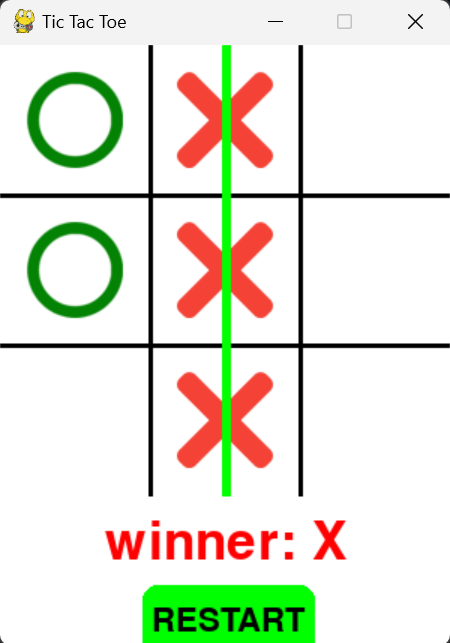

# Tic Tac Toe Game
<p align="center">
  This is a simple implementation of the classic Tic Tac Toe game using Python and Pygame.
</p>

<p align="center">
  
</p>


## Features

- Player vs Player mode
- Randomly selects the starting player (X or O)
- Detects winning combinations and highlights the winning line
- Displays the winner or if the game is a draw
- Restart button to reset the game

## Installation

1. Make sure you have Python installed. You can download it from [python.org](https://www.python.org/).

2. Install Pygame library using pip:
```
   pip install pygame
```

3. Download the game files, including `cancel.png` and `check.png` images for X and O markers, and place them in the same directory as the script.

## Running the Game

1. Open a terminal or command prompt.
2. Navigate to the directory where the game files are located.
3. Run the game script:

   ```sh
   python tic_tac_toe.py
   ```

## How to Play

- Click on any empty cell to place your marker (X or O) on the board.
- The game will automatically switch turns between the two players.
- The game will detect and display the winner or if it's a draw.
- Click the "RESTART" button to reset the game and play again.

## Code Overview

### Import Packages

```python
import pygame
import random
```

### Define Constants

- Colors, board size, images for X and O markers.

### Board Class

Handles the game logic, drawing the board, detecting the winner, and resetting the game.

### RoundRectButton Class

Handles drawing buttons with rounded corners and text.

### Main Function

Initializes Pygame, sets up the game window, handles events, and runs the game loop.

## Images

Make sure to replace `cancel.png` and `check.png` with your own images for the X and O markers.


## Acknowledgements

- Pygame documentation and community for providing examples and support.


<p align="center">
  
</p>
<p align="center">Enjoy playing Tic Tac Toe!
  
</p>